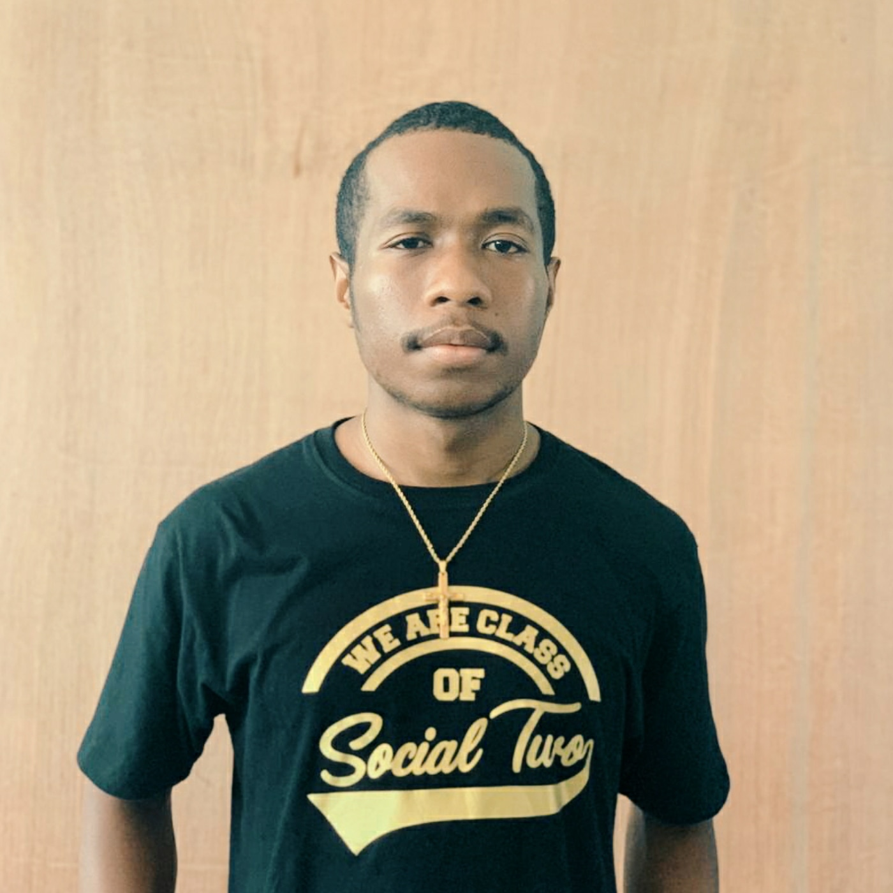

<!DOCTYPE html>
<html lang="en">
<head>
  <meta charset="UTF-8">
  <meta name="viewport" content="width=device-width, initial-scale=1.0">
  <title>Rey's Portfolio</title>
  <link href="https://fonts.googleapis.com/css2?family=Roboto:wght@300;400;700&display=swap" rel="stylesheet">
  
</head>
<body>
  <header>
    <h1>Rey - Portfolio</h1>
    <!-- Foto Profil -->
    
    
Mahasiswa Informatika dengan minat besar pada Data Science dan Database Administration, serta memiliki antusiasme terhadap analisis data dan pengembangan teknologi.

  </header>

  <section class="section">
    <h2>Tentang Saya</h2>
    
Saya Rey, seorang mahasiswa Informatika yang memiliki ketertarikan dalam bidang Data Science dan Database Administration. Saya memiliki pengalaman dalam analisis data untuk penelitian akademik dan pengembangan program berbasis AI.

  </section>

  <section class="section">
    <h2>Proyek</h2>
    

      <h3>Analisis Data Pendidikan di Salatiga</h3>
      
Proyek analisis data yang bertujuan memahami pengaruh faktor sosial ekonomi terhadap akses pendidikan mahasiswa rantau.

    

    

      <h3>Object Detection Classification</h3>
      
Pengembangan program pendeteksi objek untuk mata kuliah Artificial Intelligence menggunakan Python dan OpenCV.

    

    

      <h3>Video Edukasi Pergaulan Sehat</h3>
      
Video pendek yang mempromosikan pergaulan positif dalam lingkungan perkuliahan, bekerja dalam tim untuk menyampaikan pesan edukatif.

    

  </section>

  <section class="section contact">
    <h2>Kontak</h2>
    <a href="mailto:reynerpallo08@gmail.com">Email: reynerpallo08@gmail.com</a>
    <a href="https://github.com/reynerpallo">GitHub : reynerpallo</a>
    <a href="https://www.tiktok.com/@treeunivers_">TikTok:@treeunivers</a>
    <a href="https://www.instagram.com/treeunivers/ ">Instagram :@treeunivers </a>
  </section>

  
</body>
</html>
